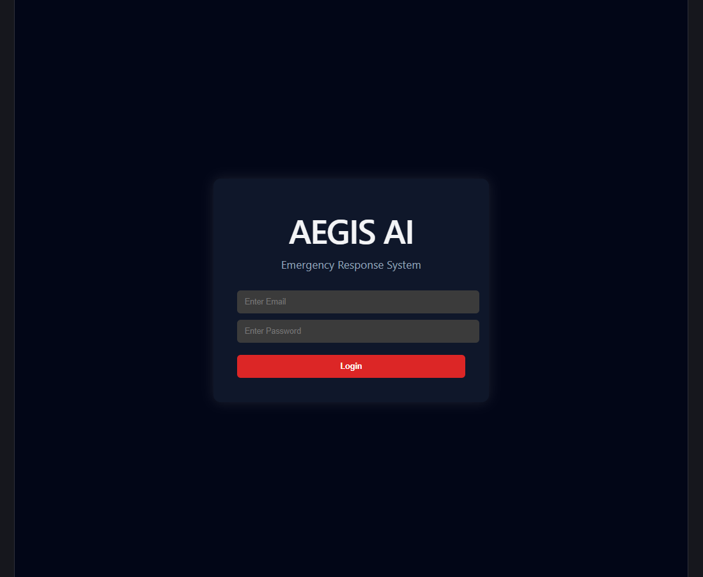
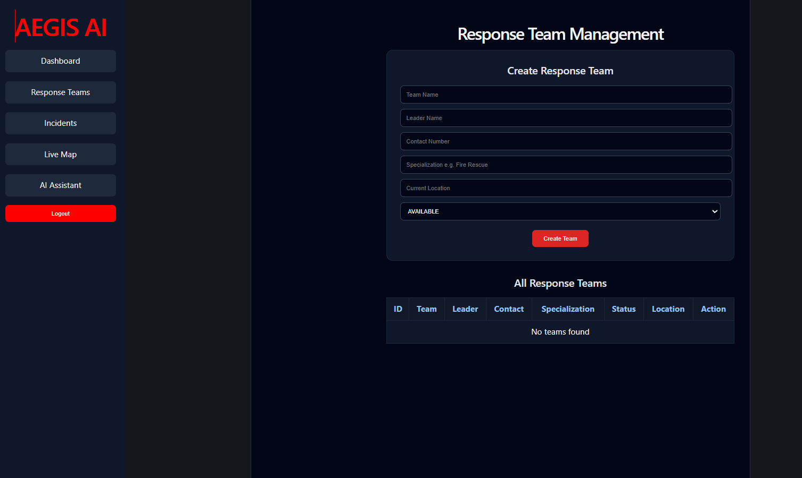
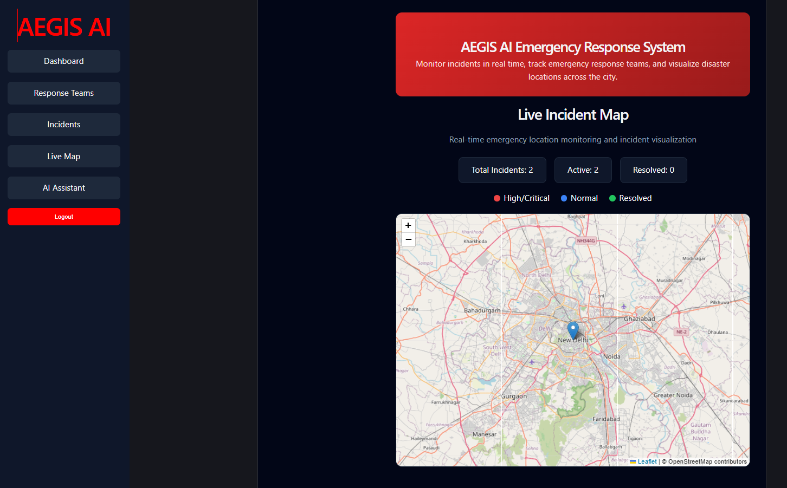

# 🚨 AEGIS AI - Emergency Response System

An AI-Powered Emergency Response and Disaster Management Platform built using React, Spring Boot, MySQL, JWT Authentication, and Google Gemini AI.

---

# 📌 Project Overview

AEGIS AI is a full-stack emergency response management system designed to help organizations monitor, manage, and respond to emergency incidents efficiently.

The platform enables users to report incidents, manage response teams, visualize emergencies on a live map, monitor analytics, and receive AI-powered emergency guidance.

This project demonstrates the integration of modern web technologies, cloud databases, AI services, authentication systems, and real-time monitoring features.

---

# 🎯 Problem Statement

During emergencies such as fires, accidents, floods, or medical incidents, organizations often face challenges in:

* Tracking incidents efficiently
* Managing emergency response teams
* Monitoring incident locations
* Coordinating emergency operations
* Providing quick guidance during disasters

AEGIS AI addresses these challenges through a centralized emergency management platform.

---

# 🚀 Key Features

## 🔐 Authentication System

* User Registration
* User Login
* JWT Authentication
* Protected Routes
* Secure Access Control

---

## 🚨 Incident Management

* Create Emergency Incidents
* View All Incidents
* Delete Incidents
* Track Incident Status
* Manage Severity Levels
* Store Incident Locations

---

## 👨‍🚒 Response Team Management

* Create Response Teams
* Manage Team Information
* Track Team Availability
* View Team Status
* Assign Teams to Emergencies

---

## 🗺️ Live Incident Map

* Real-Time Incident Visualization
* Location-Based Monitoring
* Emergency Marker Display
* Severity-Based Tracking
* Interactive Map Interface

---

## 🤖 AI Emergency Assistant

Powered by Google Gemini AI.

Features:

* Emergency Guidance
* Disaster Response Suggestions
* Safety Recommendations
* AI-Based Assistance

---

## 📊 Analytics Dashboard

Dashboard provides:

* Total Incidents
* Pending Incidents
* Resolved Incidents
* Fire Cases
* Medical Cases
* Flood Cases
* High Severity Cases
* Response Team Statistics

---

# 🛠️ Tech Stack

## Frontend

* React.js
* React Router
* Axios
* Leaflet Maps
* CSS

## Backend

* Spring Boot
* Spring Security
* JWT Authentication
* REST APIs

## Database

* MySQL (Aiven Cloud)

## AI Integration

* Google Gemini API

## Deployment

* Frontend: Vercel
* Backend: Render

## Version Control

* Git
* GitHub

---

# 🏗️ System Architecture

```text
User
 ↓
React Frontend
 ↓
Spring Boot REST APIs
 ↓
MySQL Database (Aiven)
 ↓
Analytics & Incident Data

AI Assistant
 ↓
Gemini API
```

---

# 📸 Project Screenshots

## Login Page



## Dashboard


## Incident Management


## Response Teams



## Live Incident Map



## AI Assistant


---

# 🔮 Future Enhancements

Future versions may include:

* CCTV-Based Fire Detection
* IoT Sensor Integration
* Automatic Incident Detection
* SMS Alerts
* Email Notifications
* Push Notifications
* Role-Based Access Control
* Predictive Disaster Analytics
* AI-Powered Risk Assessment

---

# 💡 Real World Applications

* Disaster Management Authorities
* Smart City Projects
* Hospitals
* Fire Departments
* Police Departments
* Airports
* Railway Stations
* Large Corporate Campuses

---

# 👨‍💻 Developer

### Harsh Pandey

BCA Student | Full Stack Developer

Skills:

* Java
* Spring Boot
* React.js
* JavaScript
* SQL
* REST APIs
* JWT Authentication
* AI Integration

---

# ⭐ Project Status

✅ Completed

✅ Fully Functional

✅ Cloud Deployed

✅ Resume Ready

✅ Portfolio Ready

---

If you found this project useful, consider giving it a ⭐ on GitHub.
